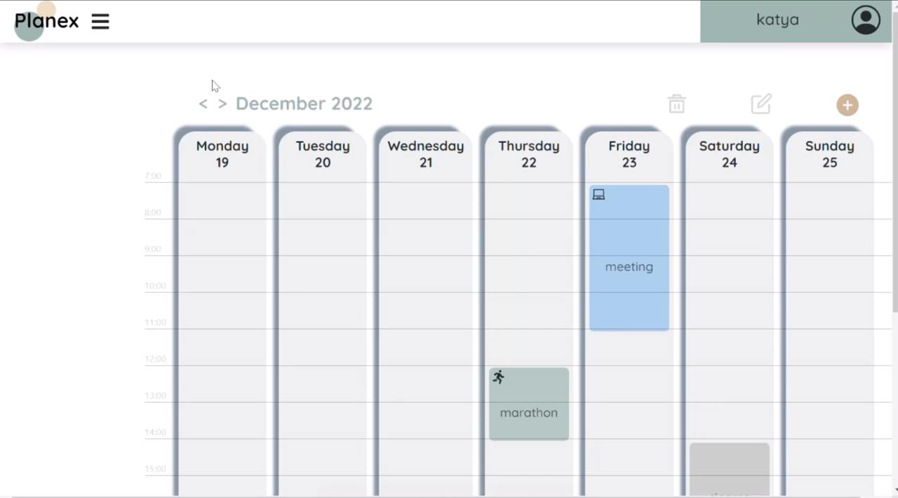
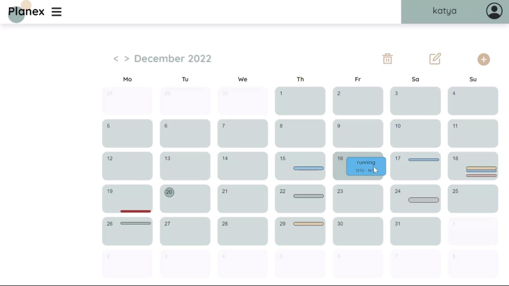
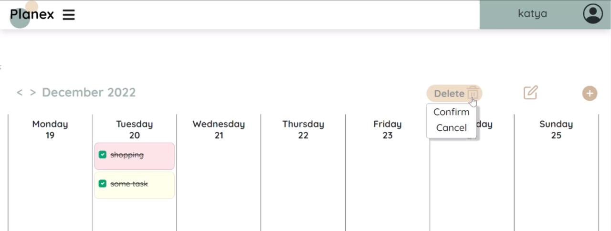

# Planex App
Planex is a versatile web application designed for personal and professional planning. 
It features a landing page for an overview, a task management system, and an event calendar supporting weekly and monthly views. Users can also customize their experience through a profile settings page. 
The application is built using **React** and **Bootstrap** on the frontend, and **Flask** with **MySQL** on the backend.

## Project Features

- **Landing Page:** Provides an overview of the application's features and functionality.
- **Task List:** Create, update, and manage tasks with a user-friendly interface.
- **Event Calendar:** Supports weekly and monthly views for managing events.
- **Profile Settings:** Allows users to update their personal information and preferences.

## Setup

Clone the repository: `git clone <repository_url>`

### Backend
Navigate to the backend directory: `cd planex-be`
Install Python dependencies: `pip install -r requirements.txt`
Configure the database connection in the .env file.
Run the backend server: `flask run`

### Frontend:
Navigate to the frontend directory: `cd react-planex-fe`
Install dependencies: `npm install`
Run the development server: `npm start`

Open the application in your browser: `http://localhost:3000`

## Docs Links:
- **React:** https://react.dev/
- **Bootstrap:** https://getbootstrap.com/docs/5.0/getting-started/introduction/
- **Flask:** https://flask.palletsprojects.com/en/stable/
- **MySQL:** https://www.mysql.com/
